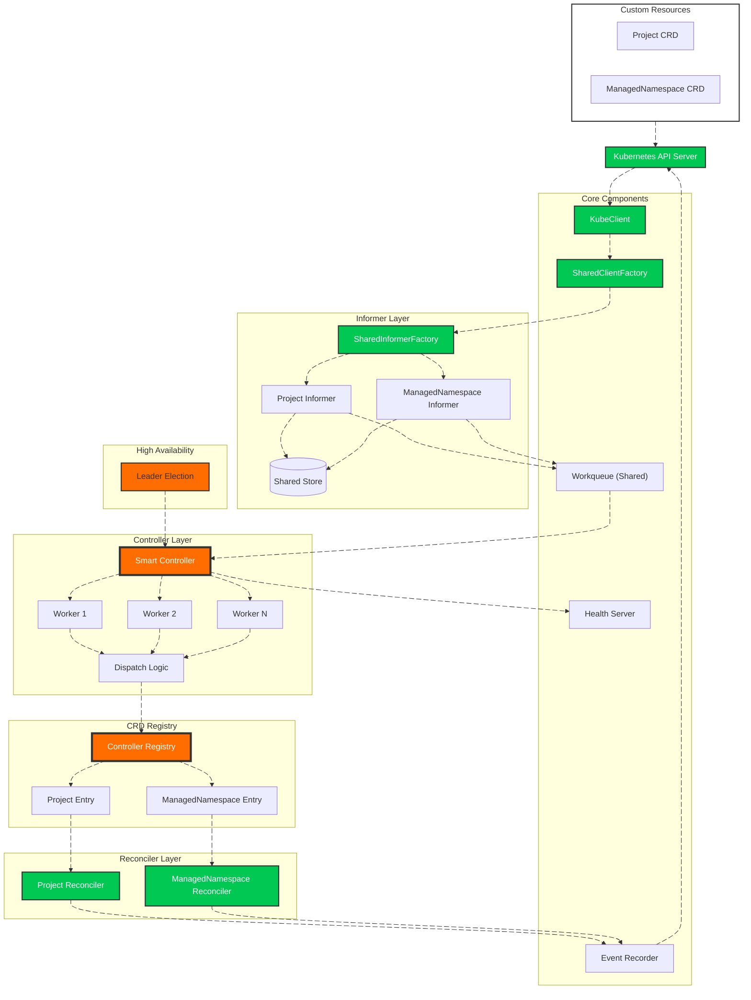

# 🚀 Multi-CRD Kubernetes Controller Framework

[](https://golang.org/)
[](https://kubernetes.io/)
[](LICENSE)

A **production-grade, multi-CRD Kubernetes controller framework** that manages multiple custom resources through a clean, registry-driven architecture. Built from scratch without controller-runtime, demonstrating deep understanding of Kubernetes internals.

Originally inspired by [@martin-helmich](https://github.com/martin-helmich/kubernetes-crd-example), this project has evolved into a **scalable, extensible operator platform** capable of managing any number of CRDs with **zero boilerplate** – just API types and your business logic.

## 🎯 **Current CRDs Supported**

| Resource | API Group | Version | Status |
|----------|-----------|---------|--------|
| `Project` | `platform.ialexeze.io` | `v1alpha1` | ✅ Production Ready |
| `ManagedNamespace` | `platform.ialexeze.io` | `v1alpha1` | ✅ Production Ready |

Adding more CRDs takes **minutes** – no controller rewrites, no code duplication, no manual client or informer implementation.

## 🏗️ **Architecture**



## ✨ **Key Features**

### 🔥 **Multi-CRD Support with Zero Boilerplate**
A **registry-driven design** allows the controller to manage any number of CRDs. Each CRD contributes:
- Its own API types (generated by controller-gen)
- Its own reconciler (your business logic)

**Everything else is automated** – clients, informers, and registration are handled by the framework.

### 🏭 **SharedInformerFactory – The Heart of the Framework**
The `SharedInformerFactory` is the crown jewel of this architecture. It:
- **Automatically creates clients** for any registered CRD via the SharedClientFactory
- **Automatically creates informers** with proper List/Watch functions
- **Maintains a shared store** for all resources
- **Feeds events into a single workqueue** for unified processing
- **Handles cache synchronization** automatically
- **Requires zero per-CRD code** – just register your type and it works

```go
// One factory to rule them all
infFactory := informer.SharedInformerFactory(provider, wq, scheme, namespace, resync)

// Get a fully-configured informer for ANY CRD
inf := infFactory.For(&yourcrdv1.YourCRD{}, ctx)  // That's it!
```

### 🧠 **Smart Controller**
A single controller processes events from **all CRDs**, dispatching them to the correct reconciler via the registry.

### 🧩 **Modular Components**
Each subsystem is a standalone, pluggable component:
- **KubeClient** with SharedClientFactory – generic Kubernetes client
- **SharedInformerFactory** – automatic informer generation
- **Event Recorder** – Kubernetes events for visibility
- **Health Server** – liveness and readiness probes
- **Shared Workqueue** – rate-limited event processing
- **CRD Registry** – central source of truth for all CRDs
- **Controller Registry** – maps GVKs to informers and reconcilers
- **Leader Election** – high availability
- **Manager** – orchestrates startup and graceful shutdown

### ⚙️ **Generic KubeClient with SharedClientFactory**
One kubeclient powers **all** CRD operations. The `SharedClientFactory` generates properly configured REST clients for any CRD on demand.

### 📦 **Clean CRD Packages**
Each CRD lives in its own well-organized package – **and that's all you need to write**:

```
api/types/
├── project/
│   └── v1alpha1/
│       ├── groupversion_info.go
│       ├── project_types.go
│       └── zz_generated.deepcopy.go
└── managedNamespace/
    └── v1alpha1/
        ├── groupversion_info.go
        ├── managednamespace_types.go
        └── zz_generated.deepcopy.go
```

**No clientset. No informer. Just your API types.**

### 🔁 **Per-CRD Reconcilers**
Clean separation of reconciliation logic – **the only thing you implement**:

```
pkg/reconciler/
├── helper.go                 # Shared utilities
├── project_reconcile.go      # Project reconciliation (your logic)
└── managed_ns_reconciler.go  # ManagedNamespace reconciliation (your logic)
```

### 🧭 **Dual Registry Architecture**

#### **CRD Registry** (`pkg/registry/crd_registry.go`)
Defines what CRDs exist and how to create them:
```go
type crd struct {
    Object     runtime.Object
    ListObject runtime.Object
	Scheme func(*runtime.Scheme) error
    Reconciler reconciler.NewReconcilerFunc
    Info       CRDInfo
}
```

#### **Controller Registry** (`pkg/registry/controller_registry.go`)
Maps GVKs to running informers and reconcilers at runtime:
```go
reg.Register(
    gvk,        // GroupVersionKind string
    crdInfo,    // CRD metadata
    informer,   // Running informer instance
    reconciler, // Your reconciler
)
```

This separation ensures that **adding a new CRD is just data** – no code changes to the core.

## 🚀 **Quick Start**

### 1. Clone and Configure
```bash
git clone https://github.com/ialexeze/multi-crd-controller.git
cd multi-crd-controller
cp .env.example .env
# Edit .env with your configuration
```

### 2. Install CRDs
```bash
kubectl apply -f crd/config/bases/
```

### 3. Run Locally
```bash
# Ensure you're in the right namespace context
kubectl config set-context --current --namespace=your-namespace

go run ./cmd/
```

### 4. Create Resources
```bash
# Create projects and managed namespaces
kubectl apply -f crd/config/samples/
```

### 5. Deploy to Production
```bash
kubectl apply -f deployment/
```

## 🔧 **Extending the Controller: Add a New CRD in Minutes**

This is where the framework truly shines. Adding a new CRD requires **zero boilerplate** – just your API types and reconciler.

### **Step 1: Generate API Types**

Create the API package structure:

```
api/types/yourcrd/v1alpha1/
├── groupversion_info.go
├── yourcrd_types.go
└── zz_generated.deepcopy.go
```

**groupversion_info.go:**
```go
package v1alpha1

import (
    metav1 "k8s.io/apimachinery/pkg/apis/meta/v1"
    "k8s.io/apimachinery/pkg/runtime"
    "k8s.io/apimachinery/pkg/runtime/schema"
)

var (
    Group      = "yourgroup.example.com"
    Version    = "v1alpha1"
    APIPath    = "/apis"
    Kind       = "YourCRD"
    NamePlural = "yourcrds"  // Resource plural name

    GroupVersion = schema.GroupVersion{
        Group:   Group,
        Version: Version,
    }

    SchemeBuilder = runtime.NewSchemeBuilder(addKnownTypes)
    AddToScheme   = SchemeBuilder.AddToScheme
)

func addKnownTypes(scheme *runtime.Scheme) error {
    scheme.AddKnownTypes(GroupVersion,
        &YourCRD{},
        &YourCRDList{},
    )

    scheme.AddKnownTypes(schema.GroupVersion{
        Group:   Group,
        Version: runtime.APIVersionInternal,
    },
        &YourCRD{},
        &YourCRDList{},
    )

    metav1.AddToGroupVersion(scheme, GroupVersion)
    return nil
}
```

**yourcrd_types.go:**
```go
package v1alpha1

import (
    metav1 "k8s.io/apimachinery/pkg/apis/meta/v1"
)

// +genclient
// +k8s:deepcopy-gen:interfaces=k8s.io/apimachinery/pkg/runtime.Object

type YourCRD struct {
    metav1.TypeMeta   `json:",inline"`
    metav1.ObjectMeta `json:"metadata,omitempty"`
    Spec              YourCRDSpec   `json:"spec"`
    Status            YourCRDStatus `json:"status,omitempty"`
}

type YourCRDSpec struct {
    Replicas int `json:"replicas"`
}

type YourCRDStatus struct {
    Phase string `json:"phase,omitempty"`
}

// +k8s:deepcopy-gen:interfaces=k8s.io/apimachinery/pkg/runtime.Object

type YourCRDList struct {
    metav1.TypeMeta `json:",inline"`
    metav1.ListMeta `json:"metadata,omitempty"`
    Items           []YourCRD `json:"items"`
}
```

Generate deepcopy code:
```bash
controller-gen object paths=./api/types/yourcrd/...
```

### **Step 2: Create Your Reconciler**

This is the **only code you write** – your business logic:

```go
// pkg/reconciler/yourcrd_reconciler.go
package reconciler

import (
    "context"
    
    "github.com/ialexeze/multi-crd-controller/pkg/config/pkg/event"
    "github.com/ialexeze/multi-crd-controller/pkg/config/pkg/logger"
    "k8s.io/client-go/tools/cache"
)

type YourCRDReconciler struct {
    events *event.Event
}

func NewYourCRDReconciler(events *event.Event) *YourCRDReconciler {
    return &YourCRDReconciler{
        events: events,
    }
}

func (r *YourCRDReconciler) Reconcile(ctx context.Context, key string) error {
    namespace, name, err := cache.SplitMetaNamespaceKey(key)
    if err != nil {
        return err
    }
    
    logger.Info().Msgf("Reconciling %s/%s", namespace, name)
    // Your business logic here
    
    return nil
}
```

### **Step 4: Register Your CRD**

Add your new CRD to the CRD registry – **this is it!**:

```go
// In pkg/registry/crd_registry.go
func buildCRDs(kube *kubeclient.Kubeclient) []crd {
    return []crd{
        // ... existing CRDs ...
        
        newCRD(
            &yourcrdv1.YourCRD{},           // Object type
            &yourcrdv1.YourCRDList{},       // List type
            CRDInfoFrom(
                yourcrdv1.Group,
                yourcrdv1.Version,
                yourcrdv1.Kind,
                yourcrdv1.APIPath,
                yourcrdv1.NamePlural,
                false,                       // IsNamespaced
            ),
            yourcrdv1.AddToScheme(scheme)   // Scheme builder function
            reconciler.NewYourCRDReconciler, // Your reconciler factory
        ),
    }
}
```

### **Step 5: Done! 🎉**

That's it. The framework automatically:
- ✅ Creates scheme with your API types
- ✅ Creates the client using SharedClientFactory
- ✅ Creates the informer using SharedInformerFactory
- ✅ Registers with the workqueue
- ✅ Registers with the controller registry
- ✅ Integrates with leader election
- ✅ Integrates with leader election
- ✅ Handles graceful shutdown

**No clientset. No informer. No interfaces. Just your API types and reconciler.**

## 📋 **What You Get**

- ✅ **Zero boilerplate** – No manual clients, informers, or interfaces
- ✅ **Auto-generated everything** – SharedInformerFactory handles it all
- ✅ **Type safety** – Each CRD maintains its own types
- ✅ **Isolation** – One CRD's bugs can't affect others
- ✅ **Scalability** – Add dozens of CRDs without performance impact
- ✅ **Maintainability** – Each reconciler is independent
- ✅ **Testability** – Each reconciler can be tested in isolation
- ✅ **Production ready** – Leader election, health checks, graceful shutdown

## 📊 **Code Reduction**

| Component | Traditional Approach | This Framework | Reduction |
|-----------|---------------------|----------------|-----------|
| Client | 120+ lines | 0 (auto) | 100% |
| Informer | 100+ lines | 0 (auto) | 100% |
| Interfaces | 80+ lines | 0 (auto) | 100% |
| GVK Implementation | 30+ lines | 0 (auto) | 100% |
| Registration | 30+ lines | 3 lines | 90% |
| **TOTAL per CRD** | **~360 lines** | **~50 lines (reconciler)** | **86%** |

## 🙏 **Acknowledgments**

This project builds upon the excellent work of:
- [**@martin-helmich**](https://github.com/martin-helmich) – for the foundational CRD example
- **Kubernetes community** – for the client-go libraries and patterns

## 📄 **License**

MIT License – see [LICENSE](LICENSE)

---

**Built with ❤️ and a deep understanding of Kubernetes internals**