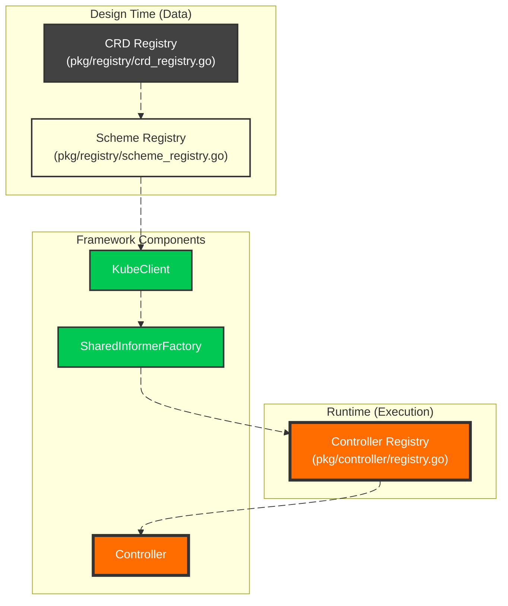
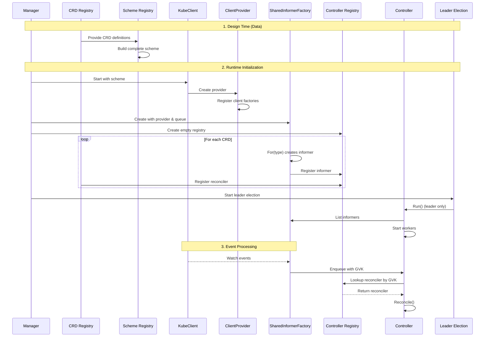

# Architectural Deep Dive

This document explains the internal architecture of the Multi‑CRD Controller Framework in detail. It covers the control loop, component lifecycle, leader election model, registry‑based dispatch, and the design decisions that make the controller **highly available**, **extensible**, and **production‑ready**.

---

## 🧠 **Core Design Philosophy**

The framework is built on three fundamental principles:

1. **Separation of Concerns** – Each component has a single, well‑defined responsibility.
2. **Registry‑Driven Dispatch** – Multiple registries work together to route events to the correct reconciler with zero boilerplate.
3. **Lifecycle Clarity** – Bootstrap vs. reconciliation phases are cleanly separated.

This approach allows the controller to manage **any number of CRDs** without changes to core components – new CRDs become **data, not code**.

---

## 🏛️ **The Three-Registry Architecture**

The framework's power comes from three distinct registries, each with a specific role:



### **1. CRD Registry** (`pkg/registry/crd_registry.go`) – **Your Only Modification Point**
```go
// This is the ONLY file you modify to add a new CRD
func buildCRDs() []crd {
    return []crd{
        newCRD(
            &projectTypev1.Project{},
            &projectTypev1.ProjectList{},
            CRDInfoFrom(projectTypev1.Group, projectTypev1.Version, 
                       projectTypev1.Kind, projectTypev1.APIPath, 
                       projectTypev1.NamePlural, "default", false),
            projectTypev1.AddToScheme,  // Your CRD's scheme registration
            reconciler.NewProjectReconciler,
        ),
    }
}
```
Each entry includes your CRD's types, metadata, scheme registration, and reconciler factory. **This is pure data** – no runtime dependencies.

### **2. Scheme Registry** (`pkg/registry/registry.go`) – **Auto-Built**
```go
scheme, err := registry.NewSchemeRegistry()  // Reads crd_registry.go automatically
```
Walks through all CRDs in `crd_registry.go`, calls their `AddToScheme` functions, and builds the complete scheme. **Zero manual registration needed.**

### **3. Controller Registry** (`pkg/controller/registry.go`) – **Runtime Dispatch**
```go
reg := controller.NewControllerRegistry()  // Maps GVKs → running informers/reconcilers
```
Populated at runtime after informers are created. Used by the controller to dispatch events to the correct reconciler based on GVK.

## 🔄 **Controller Lifecycle**

The controller follows a clear separation between **bootstrap** and **reconciliation** phases.

### Bootstrap Phase (`Start()`)

The bootstrap phase runs in **every pod**, regardless of leadership:

```go
func (c *Controller) Start(ctx context.Context) error {
    // 1. CRD Registry (pure data) is already loaded
    // 2. Scheme Registry built the complete scheme
    // 3. KubeClient initialized with that scheme
    // 4. SharedInformerFactory creates informers for all CRDs
    
    // Start all informers
    for _, informer := range c.informerFactory.ListInformers() {
        go informer.Run(ctx.Done())
    }
    
    // Wait for ALL caches to sync
    if !cache.WaitForCacheSync(ctx.Done(), 
        c.informerFactory.HasSyncedFunctions()...) {
        return fmt.Errorf("cache sync failed")
    }
    
    return nil
}
```

This design ensures that when a new leader is elected, it can begin reconciling immediately with warm caches.

### Reconciliation Phase (`RunOrDie()`) [controller.go](../pkg/controller/controller.go)

The reconciliation phase runs **only in the leader**:

```go
//  Start workers
for i := 0; i < c.workers; i++ {
    c.wg.Add(1)
    go func() {
        defer c.wg.Done()
        wait.UntilWithContext(
            ctx,
            func(ctx context.Context) {
                c.runWorker(ctx)
            }, time.Second)
    }()
}

// BLOCK until leadership is lost
<-ctx.Done()

logger.Info().Msg("leadership lost — draining workers...")

// Stop accepting new items
c.wq.Shutdown(ctx)

// Wait for all workers to finish
c.wg.Wait()
```

Workers stop cleanly when leadership is lost, ensuring no partial reconciliations.

---

## 📦 **Component Deep Dive**

### 1. **Configuration Layer** (`pkg/config`)

Environment‑based configuration with `.env` support:

```go
cfg, err := config.Init() // Automatically loads .env file, falls back to system env
```

The configuration system validates required fields and normalizes environment names (dev/staging/prod) for consistent behavior across deployments.

### 2. **Health Server** (`pkg/health`)

Provides Kubernetes liveness and readiness endpoints with environment‑aware logging:

- `/health` – Returns 200 when running (no logs in production)
- `/ready` – Returns 200 only after all components are ready

Conditional logging prevents noisy probe logs in production (`APP_ENV=production`).

### 3. **Generic KubeClient** (`pkg/kubeclient`)

A **truly generic** Kubernetes client that powers all CRD operations:

```go
kube := kubeclient.NewKubeclient(kubeclient.Config{
    Kubeconfig: cfg.Cluster().KubeconfigPath,
    Masterurl:  cfg.Cluster().MasterURL,
    Scheme:     scheme,  // Complete scheme from Scheme Registry
})
```

**Key features:**
- `Clientset()` – For built‑in Kubernetes types
- `DynamicClient()` – For unstructured operations
- `RESTClient()` – Configured with the complete scheme
- **SharedClientFactory** – Generates clients for any CRD on demand

### 4. **Shared Workqueue** (`pkg/queue`)

A single, rate‑limited workqueue that **all informers feed into**:

```go
type QueueItem struct {
    Key      string            // namespace/name
    GVK      string            // GroupVersionKind for dispatch
}

wq := queue.NewWorkqueue()
```

Features:
- Rate limiting with exponential backoff
- Deduplication of keys
- Shutdown‑aware draining
- GVK attachment for registry dispatch

### 5. **Client Provider** (`pkg/kubeclient/provider.go`)

The bridge between CRD definitions and runtime clients:

```go
provider := kube.ClientProvider()

// Register each CRD's client factory
for _, crd := range crdRegistry {
    provider.Register(crd.Object, func(k *kubeclient.Kubeclient) (informer.GenericClient, error) {
        return k.NewClient(crd.ListObject, kubeclient.CRDInfo(crd.Info))
    })
}
```

The provider can generate a client for **any registered CRD** on demand.

### 6. **SharedInformerFactory** (`pkg/informer/factory.go`)

The **crown jewel** of the framework – automatically creates informers for any CRD:

```go
infFactory := informer.SharedInformerFactory(
    provider,  // Knows how to create clients
    wq,        // Shared workqueue
    scheme,    // Complete scheme
    cfg.Cluster().Namespace,
    cfg.Cluster().DefaultResync,
)

// Get a fully-configured informer for ANY CRD
inf := infFactory.For(&yourcrdv1.YourCRD{}, ctx)  // That's it!
```

What the factory does:
1. Uses the provider to get a client for the CRD type
2. Creates a ListWatch with proper List/Watch functions
3. Builds a SharedIndexInformer with the correct type
4. Adds event handlers that enqueue to the workqueue with GVK
5. Caches informers for future requests

### 7. **Event Recorder** (`pkg/event`)

Broadcasts Kubernetes events for controller visibility:

```go
ev := event.NewEvent(kube)
```

Used by:
- Leader election to emit leadership events
- Reconcilers to emit resource events
- Appears in `kubectl describe` and `kubectl get events`

### 8. **Per‑CRD Reconcilers** (`pkg/reconciler/`)

The **only code you write** – your business logic:

```
pkg/reconciler/
├── helper.go                 # Shared utilities
├── project_reconcile.go      # Project reconciliation
├── managed_ns_reconciler.go  # ManagedNamespace reconciliation
└── application_reconcile.go  # Application reconciliation
```

Each reconciler implements a simple interface:

```go
type Reconciler interface {
    Reconcile(ctx context.Context, key string) error
}
```

The framework provides the informer store – reconcilers just fetch their object and execute logic.

### 9. **Controller Registry** (`pkg/controller/registry.go`)

The **runtime dispatch** registry:

```go
reg := controller.NewControllerRegistry()

// Register each CRD's runtime components
for _, crd := range crdRegistry {
    inf := infFactory.For(crd.Object, ctx)
    rec := crd.Reconciler(kube, inf, ev)
    
    reg.Register(
        utils.SetGroupVersionKindObj(crd.Info.GroupVersionKind),
        crd.Info,
        inf,
        rec,
    )
}
```

This registry maps GVK strings to:
- The running informer (for store access)
- The reconciler (for business logic)

### 10. **Controller Manager** (`pkg/controller/manager.go`)

A **single controller** that processes events for **all CRDs**:

```go
ctrl := controller.NewControllerManager(
    kube,
    infFactory,
    reg,
    ev,
    wq,
    cfg.Cluster().Workers,
)
```

The dispatch logic is beautifully simple:

```go
func (c *Controller) processNextItem(ctx context.Context) bool {
    item, shutdown := c.q.Queue.Get()
    if shutdown {
        return false
    }
    defer c.q.Queue.Done(item)

    // Look up reconciler by GVK (attached when enqueued)
    reconciler := c.reconcilers[tem.GVK]
    if reconciler == nil {
        logger.Error().Str("gvk", item.GVK).Msg("no reconciler found")
        c.q.Queue.Forget(item)
        return true
    }

    if err := reconciler.Reconcile(ctx, item.Key); err != nil {
        c.q.Queue.AddRateLimited(item)
        return true
    }

    c.q.Queue.Forget(item)
    return true
}
```

### 11. **Leader Election** (`pkg/leader`)

Ensures only one instance reconciles:

```go
leader := leader.NewLeaderElection(
    kube,
    ev,
    func(ctx context.Context) { ctrl.RunOrDie(ctx) },
    leader.Options{
        Namespace:     cfg.Cluster().Namespace,
        LeaseDuration: cfg.Leader().LeaseDuration,
        RenewDeadline: cfg.Leader().RenewDeadline,
        RetryPeriod:   cfg.Leader().RetryPeriod,
    })
```

Features:
- Acquires lease via Kubernetes Coordination API
- **Only leader runs workers**
- Releases lease on graceful shutdown (`ReleaseOnCancel: true`)
- Followers maintain warm caches for instant failover

### 12. **Manager** (`pkg/manager`)

The orchestrator that brings everything together:

```go
mgr := manager.NewManager(hs, cfg.Cluster().DefaultResync)

// Register all components at once
mgr.Register(components)

// Start all components in order
mgr.Start(ctx)

// Wait for shutdown
mgr.Wait()
```

The manager:
- Registers all components (health, kube, queue, factory, controller, leader)
- Starts them in the correct order
- Handles graceful shutdown on SIGINT/SIGTERM
- Sets health server ready only after all components are running
- Shuts down components in **reverse order** (leader election first!)

---

## 🎯 **How It All Works Together**



---

## ⚡ **Leader Election Model**

### Key Properties

- **Only the leader runs workers** (`Run()`)
- **All pods run informers** (`Start()`) – warm caches everywhere
- **Failover is instant** – followers already have synced caches
- **Lease is released on shutdown** – fast leadership transitions
- **Events emitted** – visibility into leadership changes

### Leadership Loss and Draining
When leadership is lost:
1. Context cancelled
2. Workers stop accepting new items
3. In‑flight reconciliations finish
4. Controller exits cleanly

**No double-processing. No partial state.**

---

## 🧪 **Why Raw client‑go?**

This framework intentionally uses **client‑go** directly rather than controller‑runtime for:

- **Full visibility** – Every line of control loop is explicit
- **Educational value** – Understand how controllers really work
- **No magic** – No hidden informers, queues, or caches
- **Lightweight** – Minimal dependencies
- **Flexible** – Custom lifecycle behavior (three-registry pattern)
- **Debugging** – Stack traces point to your code, not abstractions

controller‑runtime is excellent for production operators, but this framework is ideal for **understanding** and **controlling** the underlying mechanics.

---

## 📈 **Performance and Scaling**

### Horizontal Scaling
- Multiple replicas run simultaneously
- Only one leader reconciles
- Followers maintain warm caches
- **Failover is instant** (sub-second)

### Vertical Scaling
- Configurable workers (`WORKERS`)
- Tune resync period (`DEFAULT_RESYNC`)
- Queue rate limiting prevents storms
- Per-CRD concurrency control

### Queue Behavior
- Exponential backoff on errors
- Key deduplication
- Shutdown‑aware draining
- GVK attachment for dispatch

---

## 🎯 **The End Result**

This architecture delivers:

| Requirement | Implementation |
|-------------|----------------|
| **Multi‑CRD support** | Three-registry pattern |
| **Zero boilerplate** | SharedInformerFactory auto-generates everything |
| **Extensibility** | Add CRDs in minutes – just data |
| **High availability** | Leader election + warm caches |
| **Production readiness** | Health checks, graceful shutdown |
| **Observability** | Events, structured logs, GVK tracking |
| **Performance** | Shared queue, rate limiting, workers |
| **Testability** | Clean interfaces, fake implementations |

**Adding a new CRD is now just:**
1. Generate API types (controller-gen)
2. Write your reconciler (business logic)
3. Add **one entry** to the CRD registry
4. Done!

The framework handles **clients, informers, queues, dispatch, and lifecycle** automatically.