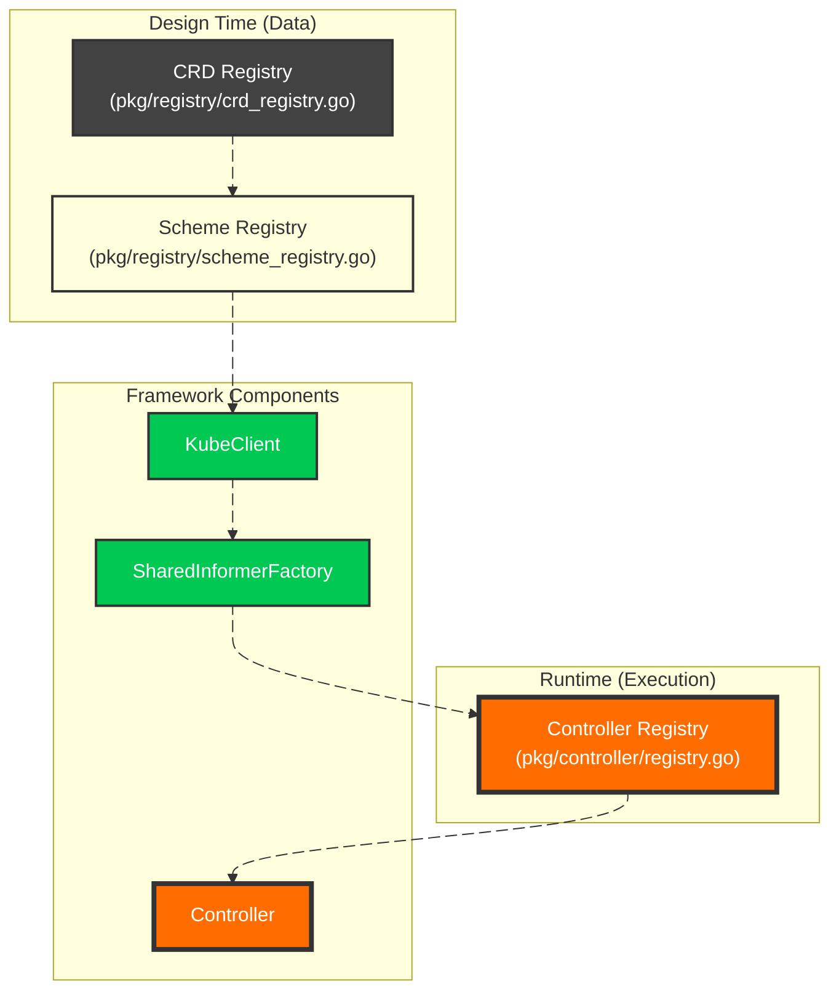
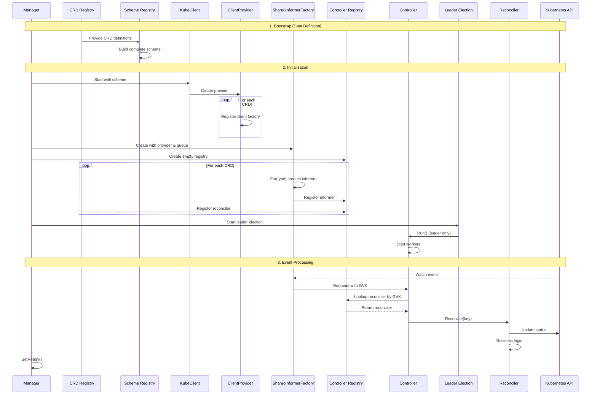

# 🏗️ **Component Deep Dive**

This document provides a comprehensive look at each component in the Multi‑CRD Controller Framework, explaining their responsibilities, interactions, and how they work together to create a **truly extensible, zero‑boilerplate controller platform**.

---

## 🎯 **Architecture Overview**

The framework is built around **three core registries** that work together to eliminate boilerplate:



---

## 📋 **Component Index**

| Component | Package | Responsibility |
|-----------|---------|----------------|
| [1. Configuration](#1-configuration-pkgconfig) | `pkg/config` | Environment-based config with `.env` support |
| [2. Health Server](#2-health-server-pkghealth) | `pkg/health` | Liveness/readiness probes with env-aware logging |
| [3. KubeClient](#3-kubeclient-pkgkubeclient) | `pkg/kubeclient` | Generic Kubernetes client with SharedClientFactory |
| [4. Workqueue](#4-workqueue-pkgqueue) | `pkg/queue` | Shared rate-limited workqueue with GVK tracking |
| [5. Event Recorder](#5-event-recorder-pkgevent) | `pkg/event` | Kubernetes event broadcasting |
| [6. CRD Registry](#6-crd-registry-pkgregistry) | `pkg/registry` | **Pure data** – defines all CRDs in the system |
| [7. Scheme Registry](#7-scheme-registry-pkgregistry) | `pkg/registry` | Builds complete scheme from CRD registry |
| [8. CRD Definition](#8-crd-definition-pkgregistry) | `pkg/registry` | Standard structure for defining a CRD |
| [9. Client Provider](#9-client-provider-pkgkubeclient) | `pkg/kubeclient` | Generates clients for any CRD on demand |
| [10. SharedInformerFactory](#10-sharedinformerfactory-pkginformer) | `pkg/informer` | **Heart of the framework** – auto-creates informers |
| [11. Controller Registry](#11-controller-registry-pkgcontroller) | `pkg/controller` | Runtime mapping of GVKs → informers/reconcilers |
| [12. Reconcilers](#12-reconcilers-pkgreconciler) | `pkg/reconciler` | **Your business logic** – the only code you write |
| [13. Controller Manager](#13-controller-manager-pkgcontroller) | `pkg/controller` | Single controller processing all CRD events |
| [14. Leader Election](#14-leader-election-pkgleader) | `pkg/leader` | High availability with lease management |
| [15. Manager](#15-manager-pkgmanager) | `pkg/manager` | Orchestrates startup/shutdown of all components |

---

## 1. **Configuration** (`pkg/config`)

Environment-based configuration with `.env` support for development and system variables for production:

```go
cfg, err := config.Init() // Automatically loads .env file, falls back to system env
```

**Key Features:**
- Loads `.env` file automatically (optional)
- Falls back to system environment variables
- Validates required fields
- Normalizes environment names (`dev`/`staging`/`prod`)

**Example `.env`:**
```bash
APP_ENV=development
KUBECONFIG=${HOME}/.kube/config
NAMESPACE=default
WORKERS=3
PORT=8080
```

---

## 2. **Health Server** (`pkg/health`)

Provides Kubernetes liveness and readiness endpoints with environment-aware logging:

```go
hs := health.NewHealthServer(cfg)
components = append(components, hs)
```

**Endpoints:**
- `/health` – Returns 200 when running (no logs in production)
- `/ready` – Returns 200 only after `SetReady()` called (no logs in production)

**Environment Awareness:**
- `APP_ENV=production` – Health checks are **silent** (no log spam)
- Otherwise – Health checks are logged for debugging

The health server is the **first to start** and **last to shut down**, ensuring proper orchestration.

---

## 3. **KubeClient** (`pkg/kubeclient`)

A **truly generic** Kubernetes client that powers all CRD operations:

```go
kube := kubeclient.NewKubeclient(kubeclient.Config{
    Kubeconfig: cfg.Cluster().KubeconfigPath,
    Masterurl:  cfg.Cluster().MasterURL,
    Scheme:     scheme,  // Complete scheme from Scheme Registry
})
components = append(components, kube)
```

**Capabilities:**
- `Clientset()` – Standard client for built-in types
- `DynamicClient()` – For unstructured operations
- `RESTClient()` – Configured with complete scheme
- `ClientProvider()` – Factory for generating CRD clients
- `NewClient()` – Creates REST client for any CRD
- `RuntimeParameterCodec()` – Consistent query encoding

**No CRD‑specific logic** – the same client works for any number of CRDs.

---

## 4. **Workqueue** (`pkg/queue`)

A shared, rate-limited workqueue that **all informers feed into**:

```go
type QueueItem struct {
    Key      string // namespace/name
    GVK      string // GroupVersionKind for dispatch
}

wq := queue.NewWorkqueue()
components = append(components, wq)
```

**Features:**
- Rate limiting with exponential backoff
- Key deduplication (prevents stacking identical keys)
- GVK attachment for registry dispatch
- Shutdown-aware draining
- Configurable workers

The queue is the **central nervous system** – all events flow through it.

---

## 5. **Event Recorder** (`pkg/event`)

Broadcasts Kubernetes events for controller visibility:

```go
ev := event.NewEvent(kube)
components = append(components, ev)
```

**Usage:**
- Leader election emits leadership events
- Reconcilers emit resource events (`kubectl describe`)
- Appears in `kubectl get events --watch`

**Example Event:**
```
LAST SEEN   TYPE      REASON              OBJECT                       MESSAGE
2m          Normal    LeaderElected       lease/resource-leader         pod-abc123 became leader
5s          Normal    ProjectReconciled   project/frontend-project      Successfully reconciled
```

---

## 6. **CRD Registry** (`pkg/registry`)

The **pure data registry** – defines what CRDs exist in the system:

```go
// NewCRDRegistry returns a list of all CRD data
crdRegistry := registry.NewCRDRegistry()  // No dependencies!
```

**Key Insight:** This registry has **zero dependencies** – it's just data. It doesn't need kubeclient, scheme, or any runtime components.

**Structure:**
```go
type crd struct {
    Object     runtime.Object           // Type (for informers)
    ListObject runtime.Object           // List type (for clients)
    Info       CRDInfo                  // Metadata
    Scheme     func(*runtime.Scheme) error // Scheme registration
    Reconciler reconciler.NewReconcilerFunc // Factory for your logic
}
```

---

## 7. **Scheme Registry** (`pkg/registry`)

Builds the complete Kubernetes scheme from the CRD registry:

```go
scheme, err := registry.NewSchemeRegistry()  // Self-contained scheme builder
if err != nil {
    logger.Fatal().Err(err).Msg("scheme creation error")
}
```

**What it does:**
1. Creates a new runtime scheme
2. Adds core Kubernetes types (`clientgoscheme`)
3. Iterates through all CRDs in the registry
4. Calls each CRD's `Scheme()` function to register its types
5. Returns the complete scheme

**Dependency:** Depends on the CRD registry (data), but nothing else.

---

## 8. **CRD Definition** (`pkg/registry`)

Standard way to define a new CRD:

```go
newCRD(
    &projectTypev1.Project{},           // Object type
    &projectTypev1.ProjectList{},       // List type
    CRDInfoFrom(                         // Metadata
        projectTypev1.Group,
        projectTypev1.Version,
        projectTypev1.Kind,
        projectTypev1.APIPath,
        projectTypev1.NamePlural,
        "default",                        // Default namespace
        false,                            // IsNamespaced
    ),
    projectTypev1.AddToScheme,            // Scheme registration
    func(kube *kubeclient.Kubeclient, inf cache.SharedIndexInformer, ev *event.Event) domain.Reconciler {
        return reconciler.NewProjectReconciler(inf, ev)  // Your reconciler
    },
)
```

This single definition provides **everything** the framework needs:
- ✅ Type information
- ✅ Metadata for API calls
- ✅ Scheme registration
- ✅ Reconciler factory

---

## 9. **Client Provider** (`pkg/kubeclient`)

Generates clients for any CRD on demand:

```go
provider := kube.ClientProvider()

// Register each CRD's client factory
for _, crd := range crdRegistry {
    provider.Register(crd.Object, func(k *kubeclient.Kubeclient) (informer.GenericClient, error) {
        return k.NewClient(crd.ListObject, kubeclient.CRDInfo(crd.Info))
    })
}
```

**How it works:**
- Stores a map from `reflect.Type` → client factory
- When `For(obj)` is called, returns a client for that type
- Client handles List/Watch operations with correct Group/Version

This enables the `SharedInformerFactory` to create informers for **any CRD** without knowing its details in advance.

---

## 10. **SharedInformerFactory** (`pkg/informer`)

The **heart of the framework** – automatically creates informers for any registered CRD:

```go
infFactory := informer.SharedInformerFactory(
    provider,  // Knows how to create clients
    wq,        // Shared workqueue
    scheme,    // Complete scheme
    cfg.Cluster().Namespace,
    cfg.Cluster().DefaultResync,
)
components = append(components, infFactory)

// Get a fully-configured informer for ANY CRD
inf := infFactory.For(&yourcrdv1.YourCRD{}, ctx)  // That's it!
```

**What the factory does:**
1. Uses provider to get a client for the CRD type
2. Creates a ListWatch with proper List/Watch functions
3. Builds a `SharedIndexInformer` with the correct type
4. Adds event handlers that enqueue to workqueue with GVK
5. Caches informers for future requests
6. Starts all informers when `Start()` is called
7. Waits for cache sync

**This single component eliminates ~100 lines of boilerplate per CRD.**

---

## 11. **Controller Registry** (`pkg/controller`)

The **runtime dispatch registry** – maps GVKs to running components:

```go
reg := controller.NewControllerRegistry()

// Register each CRD's runtime components
for _, crd := range crdRegistry {
    inf := infFactory.For(crd.Object, ctx)
    rec := crd.Reconciler(kube, inf, ev)
    
    reg.Register(
        utils.SetGroupVersionKindObj(crd.Info.GroupVersionKind),
        crd.Info,
        inf,
        rec,
    )
}
```

**What it stores:**
- GVK string → CRD metadata
- GVK string → Running informer (for store access)
- GVK string → Reconciler (for business logic)

**Dependency:** Created **after** informers are running, **before** controller starts.

---

## 12. **Reconcilers** (`pkg/reconciler`)

**The only code you write** – your business logic:

```go
type Reconciler interface {
    Reconcile(ctx context.Context, key string) error
}
```

**Structure:**
```
pkg/reconciler/
├── helper.go                 # Shared utilities
├── project_reconcile.go      # Project reconciliation
├── managed_ns_reconciler.go  # ManagedNamespace reconciliation
└── application_reconcile.go  # Application reconciliation
```

**What a reconciler does:**
1. Receives a `namespace/name` key
2. Fetches the object from the informer store
3. Handles deletion (if object not found)
4. Executes business logic
5. Emits Kubernetes events via event recorder
6. Returns error to trigger retry (with backoff)

**Example:**
```go
func (r *ProjectReconciler) Reconcile(ctx context.Context, key string) error {
    namespace, name, _ := cache.SplitMetaNamespaceKey(key)
    
    obj, exists, err := r.informer.GetStore().GetByKey(key)
    if err != nil || !exists {
        return r.handleDeletion(namespace, name)
    }
    
    project := obj.(*v1alpha1.Project)
    logger.Info().Msgf("Reconciling %s/%s", namespace, name)
    
    // Your business logic here...
    
    return nil
}
```

---

## 13. **Controller Manager** (`pkg/controller`)

A **single controller** that processes events for **all CRDs**:

```go
ctrl := controller.NewControllerManager(
    kube,
    infFactory,
    reg,
    ev,
    wq,
    cfg.Cluster().Workers,
)
components = append(components, ctrl)
```

**Dispatch logic:**
```go
func (c *Controller) processNextItem(ctx context.Context) bool {
    item, shutdown := c.q.Queue.Get()
    if shutdown {
        return false
    }
    defer c.q.Queue.Done(item)

    // Look up reconciler by GVK (attached when enqueued)
    reconciler := c.reconcilers[item.GVK]
    if reconciler == nil {
        c.q.Queue.Forget(item)
        return true
    }

    if err := reconciler.Reconcile(ctx, item.Key); err != nil {
        c.q.Queue.AddRateLimited(item) // Retry with backoff
        return true
    }

    c.q.Queue.Forget(item)
    return true
}
```

**Key properties:**
- **Never needs to change** when new CRDs are added
- Configurable workers for concurrency
- Rate limiting from queue
- Graceful shutdown on leadership loss

---

## 14. **Leader Election** (`pkg/leader`)

Ensures only one instance reconciles at a time: [main.go](../cmd/main.go)

```go
startup.manager.AddPostStartHook(func(ctx context.Context) {
    leader := leader.NewLeaderElection(
        startup.kube,
        startup.event,
        func(ctx context.Context) { startup.controller.RunOrDie(ctx) }, // controller run
        leader.Options{
            Namespace:     cfg.Cluster().Namespace,
            LeaseDuration: cfg.Leader().LeaseDuration,
            RenewDeadline: cfg.Leader().RenewDeadline,
            RetryPeriod:   cfg.Leader().RetryPeriod,
        })
    
    leader.Start(ctx)
})
```

**Features:**
- Starts leader election as postStartHook AFTER manager is ready
- Acquires lease via Kubernetes Coordination API
- **Only leader runs controller workers**
- Followers maintain warm caches for instant failover
- Emits leader election events
- Releases lease on graceful shutdown (`ReleaseOnCancel: true`)

---

## 15. **Manager** (`pkg/manager`)

The orchestrator that brings everything together:

```go
mgr := manager.NewManager(hs, cfg.Cluster().DefaultResync)

// Register all components at once
mgr.Register(components)

// Start all components in order
if err := mgr.Start(ctx); err != nil {
    logger.Fatal().Err(err).Msg("failed to start manager")
}

// Wait for shutdown
mgr.Wait()
```

**Responsibilities:**
- Registers all components (health, kube, queue, factory, controller, leader)
- Starts them in correct dependency order
- Handles graceful shutdown on SIGINT/SIGTERM
- Sets health server ready only after all components running
- Shuts down components in **reverse order** (leader election first!)

**Shutdown order:**
```
1. Leader Election (releases lease)
2. Controller (stops workers)
3. SharedInformerFactory (stops informers)
4. Queue (drains)
5. Event Recorder
6. KubeClient
7. Health Server (last)
```

---

## 🎯 **Component Interaction Flow**



---

## 🏆 **What This Architecture Delivers**

| Requirement | Implementation |
|-------------|----------------|
| **Multi‑CRD support** | Three-registry pattern – CRD, Scheme, Controller |
| **Zero boilerplate** | SharedInformerFactory auto-generates everything |
| **Extensibility** | Add CRDs in minutes – just data, no code changes |
| **High availability** | Leader election + warm caches = instant failover |
| **Production ready** | Health checks, graceful shutdown, rate limiting |
| **Observability** | Events, structured logs, GVK tracking |
| **Performance** | Shared queue, worker pools, exponential backoff |
| **Testability** | Clean interfaces, fake implementations |

**Adding a new CRD is now:**
1. Generate API types (controller-gen)
2. Write your reconciler (business logic)
3. Add **one entry** to `buildCRDs()`
4. Done!

The framework handles **clients, informers, queues, dispatch, and lifecycle** automatically.